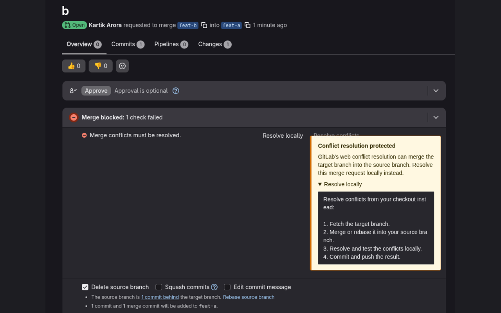

# GitLab Conflict Guard

[](CHANGELOG.md) [](../../actions/workflows/ci.yml)

GitLab Conflict Guard is a small Chrome extension that helps developers avoid GitLab's web conflict-resolution workflow. GitLab's web resolver can update the source branch by creating a merge commit from the target branch. This extension blocks **Resolve conflicts**, shows a clear warning, and directs developers to resolve conflicts locally instead.

It is a workflow guardrail, not a security product.



> Replace the `OWNER/REPOSITORY` badge target and the promotional-art placeholders before publishing.

## Installation

### Chrome Web Store

The public listing will be linked here after the first publication.

### Load unpacked (development)

1. Download or clone this repository.
2. Open `chrome://extensions` and enable **Developer mode**.
3. Choose **Load unpacked** and select the repository root.
4. Open the extension's **Details** page and choose **Extension options**.
5. Save the GitLab domain or domains you want to protect, then accept Chrome's narrowly scoped host-access prompt.

## Configuration

- **GitLab domains:** Exact hostnames only, one per line. For example: `gitlab.com` or `gitlab.example.com`. Subdomains are not implicitly included.

The warning includes a fixed local-resolution checklist: fetch the target branch, merge or rebase locally, resolve and test conflicts, then commit and push.

The extension requests host access only for the saved domains. It has no access to unrelated websites.

### Organization-managed domains

Organizations can centrally set and lock allowed GitLab domains through Chrome Enterprise policy. See [ENTERPRISE.md](ENTERPRISE.md). When that policy is present, it overrides the local domain setting.

## Supported GitLab versions

The extension targets the current GitLab merge-request UI on GitLab.com and self-managed GitLab instances. It detects the action by its accessible text and conflicts URL rather than a version-specific component. GitLab does not provide a stable DOM contract for this UI, so test against your supported GitLab version before deploying it broadly.

## Limitations

- It guards the browser UI only; it cannot prevent API, CLI, or other users from resolving conflicts.
- A substantial GitLab UI change can prevent detection. In that case it fails open and does not interfere with GitLab.
- Only exact saved hostnames are protected.
- The warning is a workflow recommendation; review your team's merge strategy separately.

## FAQ

### Does it send my merge-request data anywhere?

No. It makes no external requests and stores only its settings in Chrome Sync storage.

### Why does Chrome ask for access to my GitLab domain?

The extension must read and modify the **Resolve conflicts** action on that domain. Access is requested only after you save the exact hostname.

### What should I do instead?

Fetch the target branch, merge or rebase locally according to your team policy, resolve and test the conflicts, then commit and push.

## Local development

This project has no runtime dependencies. Use Node.js 18 or newer.

```sh
npm test
npm run lint
npm run build
```

Load the repository root through `chrome://extensions` while developing. After editing extension files, click **Reload** on the extension card. After changing allowed domains, save from Extension options to re-register the content script.

## Building and packaging

```sh
npm run package
```

This creates `dist/gitlab-conflict-guard-v0.1.0.zip`, the archive to upload to the Chrome Web Store. The package contains only the manifest, source, and required assets.

## Testing

`npm test` runs the unit tests for settings validation, exact-domain matching, conflict-action detection, and SPA observer behavior. `npm run lint` validates the release manifest and required release files.

For a manual browser test, configure a test GitLab hostname, open a merge request that has conflicts, and confirm the notice appears and the web action is blocked.

## Contributing

See [CONTRIBUTING.md](CONTRIBUTING.md). Please keep changes focused on the conflict-resolution guardrail and include tests for behavior changes.

## License

MIT. See [LICENSE](LICENSE).
